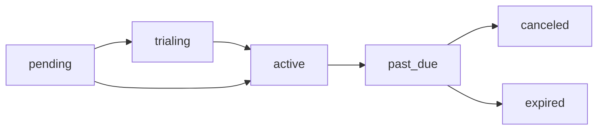

A **Subscription** is the record that links a tenant to a plan. It tracks billing periods, payment status, trial dates, and seat counts. Every status change is recorded to an immutable event log.

## Subscription Statuses

| Status | Description |
|---|---|
| `pending` | Created but not yet activated (awaiting payment confirmation) |
| `trialing` | In a free trial period |
| `active` | Paid and active |
| `past_due` | Payment failed — grace period |
| `canceled` | Canceled by tenant or admin |
| `expired` | Trial or subscription ended without renewal |

## Status Transitions



Transitions are triggered by Stripe webhook events:

| Event | Transition |
|---|---|
| `checkout.session.completed` | `pending` → `active` or `trialing` |
| `customer.subscription.updated` | `trialing` → `active` |
| `invoice.payment_failed` | `active` → `past_due` |
| `customer.subscription.deleted` | any → `canceled` |

## Subscription Fields

```json
{
  "id": "sub_crovver_abc123",
  "status": "active",
  "tenantId": "ten_xyz",
  "planId": "plan_pro",
  "trialEndsAt": null,
  "currentPeriodStart": "2025-01-01T00:00:00Z",
  "currentPeriodEnd": "2025-02-01T00:00:00Z",
  "canceledAt": null,
  "capacityUnits": 15,
  "usedCapacity": 12,
  "providerSubscriptionId": "sub_stripe_...",
  "providerCustomerId": "cus_stripe_..."
}
```

## Event Sourcing

Every subscription status change is written to `subscription_events`. This gives you a complete audit trail:

```json
{
  "event_type": "subscription.activated",
  "previous_status": "trialing",
  "new_status": "active",
  "occurred_at": "2025-02-01T00:00:00Z",
  "metadata": {
    "stripe_event_id": "evt_...",
    "invoice_id": "in_..."
  }
}
```

## Checking Subscription Status

Use the React SDK hook on the frontend:

```tsx
import { useSubscription } from 'crovver-react';

function Dashboard() {
  const { isActive, plan, subscription } = useSubscription();

  if (!isActive) return <UpgradePrompt />;

  return <App trialEndsAt={subscription?.trialEndsAt} />;
}
```

Or query the API from your backend:

```bash
GET /api/public/subscriptions/status?publicKey=pk_live_...&tenantId=workspace_123
```
