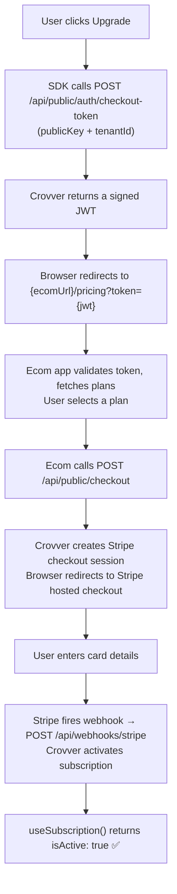

This guide explains what happens from the moment a user clicks "Upgrade" to when their subscription is active in your app.

## Flow Overview



## Step 1 — Trigger from Your App

Use `useBillingRedirect` in your React frontend:

```tsx
import { useBillingRedirect } from 'crovver-react';

const { redirectToCheckout } = useBillingRedirect();

// On button click:
redirectToCheckout();

// Or pre-select a plan/feature:
redirectToCheckout({ requiredFeature: 'advanced_analytics' });
```

## Step 2 — Checkout Token

The SDK calls the Crovver API to mint a short-lived JWT (10 minutes):

```bash
POST /api/public/auth/checkout-token
x-public-key: pk_live_...

{
  "externalTenantId": "workspace_123",
  "returnUrl": "https://yourapp.com/dashboard"
}
```

```json
{
  "success": true,
  "data": {
    "token": "eyJhbGciOiJIUzI1NiJ9...",
    "expiresAt": "2025-01-01T00:10:00Z"
  }
}
```

## Step 3 — Plan Selection

The ecom app renders your available plans. The token carries the tenant context so the correct org's plans are shown.

## Step 4 — Create Checkout Session

The ecom app calls Crovver to create a Stripe session:

```bash
POST /api/public/checkout
x-service-key: <CROVVER_SERVICE_KEY>

{
  "requestingTenantId": "workspace_123",
  "planId": "plan_pro",
  "provider": "stripe",
  "successUrl": "https://yourapp.com/welcome",
  "cancelUrl": "https://ecom.yourapp.com/pricing?canceled=true"
}
```

## Step 5 — Stripe Webhook

After payment, Stripe calls your webhook. Crovver processes `checkout.session.completed` and activates the subscription. The subscription status moves from `pending` → `active` (or `trialing` if the plan has a trial).

## Step 6 — Back in Your App

The user returns to `successUrl`. Calling `refresh()` from `useSubscription` will re-fetch the now-active subscription:

```tsx
const { refresh, isActive } = useSubscription();

useEffect(() => {
  if (searchParams.get('checkout') === 'success') {
    refresh();
  }
}, []);
```

## Seat-Based Checkout

For seat-based plans, include `totalCapacityUnits`:

```bash
POST /api/public/checkout
{
  "requestingTenantId": "workspace_123",
  "planId": "plan_business",
  "provider": "stripe",
  "totalCapacityUnits": 15
}
```

Crovver calculates the prorated price and creates the session accordingly.
